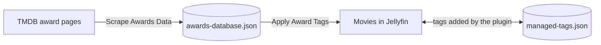

# How it works

## Data flow

1. **Discover** — *Discover Organizations* reads TMDB's award index (`/award`, all pages) and stores the list in the plugin settings.
2. **Scrape** — *Scrape Awards Data* downloads each selected organization's page, then every ceremony page, and records categories, nominees and winners. Re-scraping a ceremony replaces its previous data, so the task can be run any number of times.
3. **Apply** — *Apply Award Tags* looks up each movie by its TMDB ID, builds the tags from the configured format, and updates the movie. Only movies are processed; TV shows are not tagged.

## Managed tags

The plugin records every tag it adds in `managed-tags.json`. On each run it compares the new set of tags for a movie with the recorded set, removes the ones that no longer apply and adds the new ones. Tags you add yourself are never in that record, so they are never touched, even if they look like award tags.

## Files

Both files live in the plugin's data folder, `<jellyfin-data>/plugins/Jellyfin.Plugin.AwardsMetadata/`:

| File | Contents |
| --- | --- |
| `awards-database.json` | Scraped organizations, ceremonies and nominations |
| `managed-tags.json` | Tags the plugin has added, per movie |

Deleting `awards-database.json` only means the next scrape starts from scratch. Deleting `managed-tags.json` makes the plugin forget which tags it owns, so existing award tags would then have to be removed by hand.

## Talking to TMDB

- Requests are spaced by **Rate Limit Delay** and time out after **Request Timeout**.
- Failed requests are retried up to **Max Retry Count** times with exponential back-off (2, 4, 8 … seconds).
- HTTP 429 responses honor `Retry-After`, capped at 60 seconds.
- Responses larger than 10 MB are rejected.
- Only `https://www.themoviedb.org` (or `themoviedb.org`) can be contacted.

The plugin parses TMDB's web pages, not an API. If TMDB changes its page layout, scraping may stop finding data until the plugin is updated.

## Security notes

- The *Discover Organizations* endpoint (`POST /AwardsMetadata/DiscoverOrganizations`) requires an administrator.
- The awards database path is restricted to the plugin's data folder.

## Compatibility and updates

Each release is built for one Jellyfin version, recorded as `targetAbi` in the release's `meta.json` and in the plugin catalog. Jellyfin only offers catalog versions whose `targetAbi` is not newer than the server, and refuses to load an installed plugin built for a newer server. The catalog keeps the newest release for every supported Jellyfin version, so servers that have not been upgraded keep receiving the release built for them.
